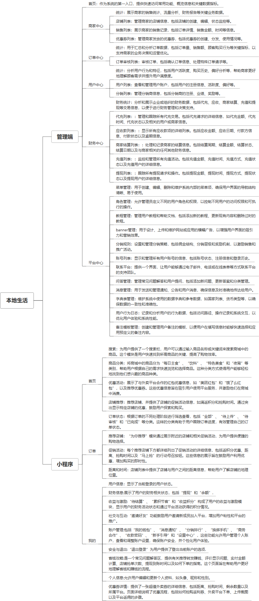

 

    
 

公司拥有上百套具有自主知识产权的软件系统，详情请查看码云首页或公司官网

 
<h1>本地生活小程序</h1>

<a href="https://www.haishi.net.cn/">公司官网</a> ｜ <a href="https://www.haishi.net.cn/">在线体验</a>

 

## 系统介绍

本地生活小程序 团购、红包、补贴、分销等，接入美团红包、饿了么红包等服务，可接入分销商
本地生活小程序 团购、红包、补贴、分销等，接入美团红包、饿了么红包等服务，可接入分销商
-------------------------------------------------------------------------------------
本项目名称为本地生活小程序管理平台，是面向本地生活商家提供服务的平台，可以管理商家店铺、商品、订单、用户、财务等信息，功能覆盖了商家经营的各个方面。
本项目从用户层面可以分为两个端：管理端、用户端。
- 管理端：商家管理员使用，可以进行店铺管理、商品管理、订单管理、用户管理、财务管理、平台中心管理等。
- 用户端：C端用户使用，可以通过小程序平台浏览商品、下单、支付等。
---
                

## 系统功能介绍

### 系统包含终端说明

管理端（WEB）、用户端（H5）

| 序号 | 模块               | 模块说明 |
| ---- | ------------------ | -------- |
| 1    | FWY-TG-BDSH-MANAGE | 管理端   |
| 2    | FWY-TG-BDSH-SERVER | 服务端   |
| 3    | FWY-TG-BDSH-H5     | H5端     |

### 系统功能结构

### 系统功能说明

- 商家中心：管理店铺、商品、订单等信息
- 订单中心：管理订单审核
- 用户中心：管理用户和分销
- 财务中心：管理财务统计、代充、应收款、商家结算、充值、提现
- 平台中心：管理菜单、角色、Banner、分销规则

## 系统主要界面

## 系统技术说明

### 代码模块说明

| 序号 | 目录                     | 目录说明 |
| ---- | ------------------------ | -------- |
| 1    | FWY-TG-BDSH-SERVER/.idea | --       |
| 2    | FWY-TG-BDSH-SERVER/src   | --       |

### 系统技术选型

#### 开发语言/框架

JAVA（JDK1.8）
前端框架：VUE2
其他

#### 服务中间件

Nginx
Tomcat

#### 数据库

MySQL（5.7+）

#### 其他说明

无

## 系统演示/商用

请扫码添加客服微信获取演示地址和系统详细资料。

如果您想基于本地生活小程序进行商业化交付或定制开发服务，我们提供有偿的技术服务支持，合作模式不限，欢迎沟通！

公司官网地址： <a href="https://www.haishi.net.cn/">https://www.haishi.net.cn</a>

联系客服获取专业回答。

## 使用须知

1、 本项目商用必须获得版权所有者的授权。

2、 未经允许本项目代码不允许二次出售。

